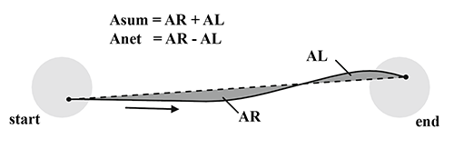

# asumanet

**Author(s):**

Evan Pezent

**Description:**

Computes the areas enclosed between a curve and the straight line connecting its endpoints. Returns Anet (difference in areas between left and right side) and Asum (sum of areas). Both metrics are typically used to evaluate the quality of human movement (e.g. wrist pointing **[1]**).

1. S. K. Charles and N. Hogan, “The curvature and variability of wrist and arm movements,” *Experimental Brain Research*, vol. 203, no. 1, pp. 63–73, 2010.

**Usage:**

See `example.m`.
