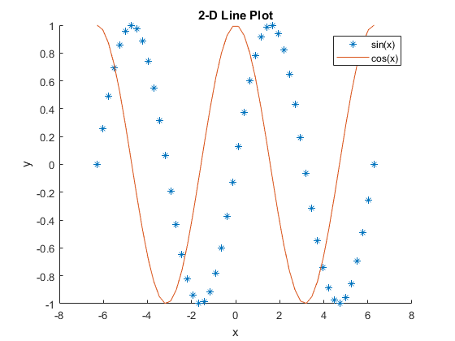
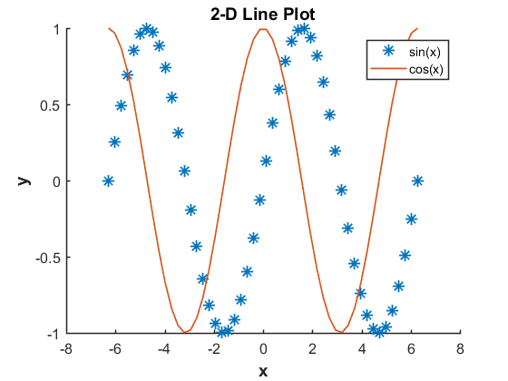

# plotfixer

**Author(s):**

Matt Svrcek, William Greenbaum, and Zane Zook

**Description:**

Takes any open figures in Matlab and it slightly beautifies the figures. The function is easily customizable and useful when making many single plots.

Figure before plotfixer with default functions:

Figure after plotfixer

**Usage:**

See 'plotfixerExample.m'. Produces 'after.png'