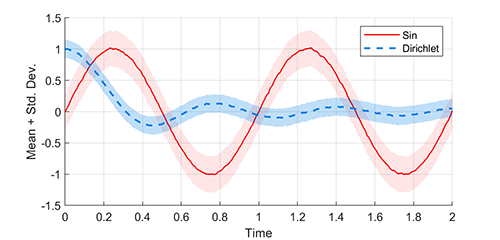

# plotshaded

**Author(s):**

Evan Pezent

**Description:**

Plots a curve with a shaded background region which may be used to represented standard deviation, confidence intervals, etc. Allows for normal [line specification](https://www.mathworks.com/help/matlab/ref/linespec.html) in the same function call. Shaded regions will not pollute legend entries.

**Usage:**

See `example.m`.
