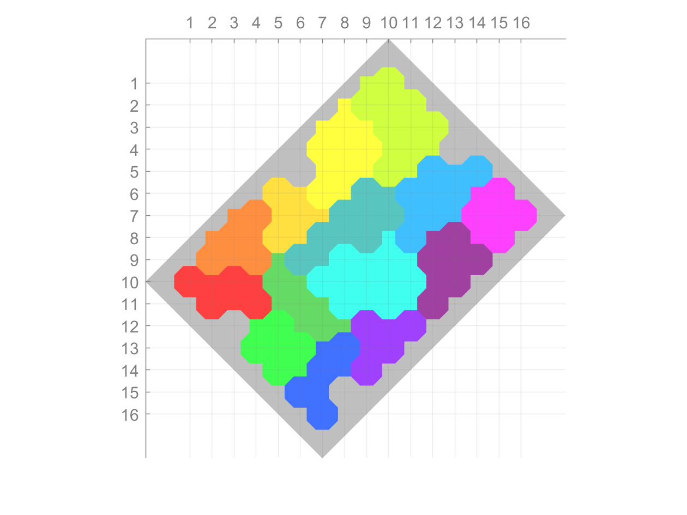

# puzzometry

**Author(s):**

Evan Pezent

**Description:**

Solves that [damn puzzle](http://www.puzzometry.com/) on the coffee table.

**Usage:**

Run `puzzometry.m`. Set `animation` to `0` for no animation, `1` for fast animation, or `2` for detailed animation.
