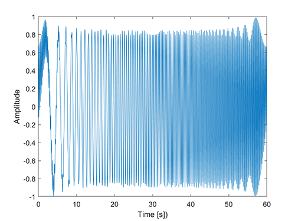

# schroeder

**Author(s):**

Evan Pezent

**Description:**

Produces a Schroeder multisine excitation signal **[1]** with min and max frequencies over a defined duration and sampling frequency. A Schroeder multisine is typically used as a control input to a system for means of system identification. Because it is flat in the power spectrum over the specified frequency range, it may be preferred over a simple chirp or frequency sweep.

1. M. A. Schroeder, “Synthesis of low peak-factor signals and binary sequences of low autocorrelation,” *IEEE Trans. Info. Theory*, vol. 16, pp. 85–89, 1970.

**Usage:**

See `example.m`.
